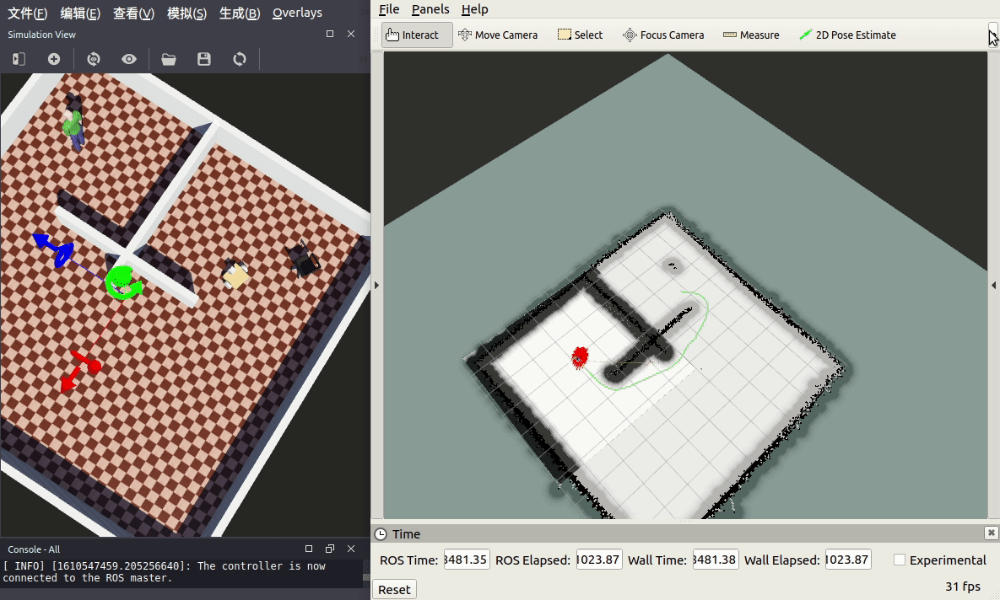
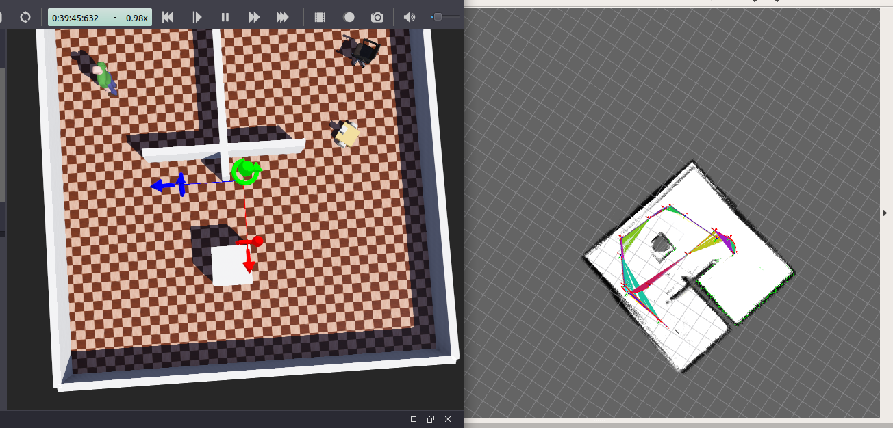

# webots_demo

## 操作方法
1. 命令行进入`catkin_ws/src`
``` shell
$ cd catkin_ws/src
$ git clone https://github.com/JackyMao1999/webots_demo.git
```
2. 编译
``` shell
$ catkin_make
```
3. 运行
``` shell
$ roslaunch webots_demo slam_no_gmapping.launch
$ roslaunch webots_demo move_base.launch
$ rosrun  webots_demo demo_2dnav_move
```
## 效果

注意：

- 再学习本系列教程时，应该已经安装过ROS了并且需要有一些ROS的基本知识
- 这个教程能手把手带领大家解决webots和ROS联合仿真的问题，我也是摸爬滚打完成的，希望能帮助到大家。
- 后续依旧会发布新的内容，大家可以持续关注～～～
- 大家有什么问题也可以在下面评论，我看到后会恢复～～～

**webots版本：2020b rev1**

**ros版本：melodic**

[ROS联合webots实战案例(一)安装配置webots](https://blog.csdn.net/xiaokai1999/article/details/112545103)

[ROS联合webots实战案例(二)在webots中搭建机器人](https://blog.csdn.net/xiaokai1999/article/details/112545173)

[ROS联合webots实战案例(三[1])在webots中使用ROS控制机器人](https://blog.csdn.net/xiaokai1999/article/details/112545405)

[ROS联合webots实战案例(三[2])使用外接手柄控制机器人](https://blog.csdn.net/xiaokai1999/article/details/112545545)

[ROS联合webots实战案例(四)webots中使用激光雷达](https://blog.csdn.net/xiaokai1999/article/details/112545602)

[ROS联合webots实战案例(五)导航功能包入门1](https://blog.csdn.net/xiaokai1999/article/details/112596613)

[ROS联合webots实战案例(五)导航功能包入门2](https://blog.csdn.net/xiaokai1999/article/details/112596640)

2021.01.26更新ROS1结合Webots实现Cartographer建图与导航


结语
本文也是基于笔者的学习和使用经验总结的，主观性较强，如果有哪些不对的地方或者不明白的地方，欢迎评论区留言交流~
这个教程能手把手带领大家解决webots和ROS联合仿真的问题，我也是摸爬滚打完成的，希望能帮助到大家。

✌Bye
